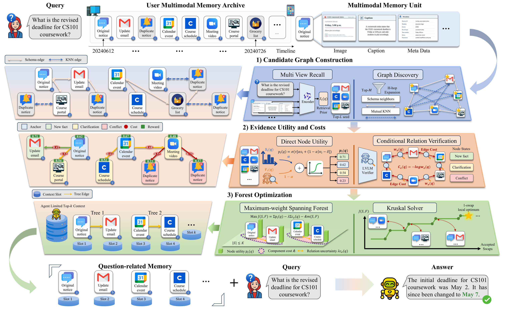
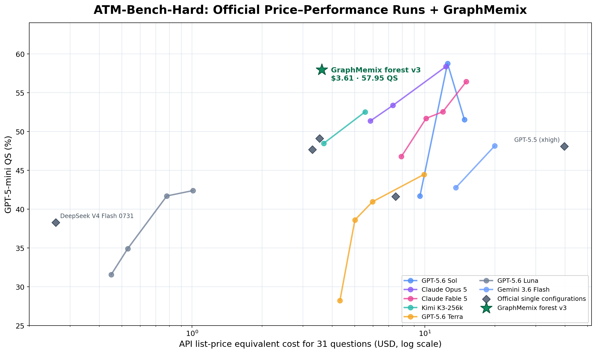

<p align="center">
  
</p>

<p align="center">
  <em>Query-time evidence organization for long-term multimodal memory.</em>
</p>

GraphMemix builds a bounded, query-relevant graph over multimodal memories. It
combines multi-view retrieval, direct-evidence verification,
anchor-conditioned relation verification, and evidence-forest optimization to
produce a compact context for the final reader.

<p align="center" width="100%">
  
</p>

The repository provides the GraphMemix implementation, a unified benchmark
harness, reproducible evaluation contracts, baseline adapters, and an
ATM-Bench-Hard evidence-graph extension.

## 📰 Updates

- **2026-08-27** — Paper released on [arXiv:2608.26983](https://arxiv.org/abs/2608.26983).

## 🎯 Overview

- **Query-aware candidate graph.** Multi-view retrieval finds seed memories;
  schema and semantic relations expand a bounded candidate set.
- **Separated evidence verification.** A node verifier estimates direct
  support, while the Evidence-Chain Verifier (ECV) estimates the incremental
  value of a candidate relative to an anchor.
- **Evidence-forest optimization.** GraphMemix jointly selects memories and
  reliable relations under a maximum reader budget.
- **Native multimodal context.** The reader receives selected image, video,
  email, and text evidence rather than only generated summaries.

```text
multimodal archive + query
          │
          ▼
multi-view retrieval ──► bounded candidate graph
                                │
                      ┌─────────┴─────────┐
                      ▼                   ▼
               node verifier             ECV
                      └─────────┬─────────┘
                                ▼
                     evidence-forest optimizer
                                ▼
                       compact reader context
```

## 📊 Main Results

All values are GPT-5-mini Judge Accuracy (%). Each backbone configuration uses
the same model for node verification, ECV, and final answering.

### Qwen3-VL-8B-Instruct

| Method | ATM-Bench | Mem-Gallery | MemEye | H2HMem | Average |
| :-- | --: | --: | --: | --: | --: |
| A-MEM | 41.86 | 52.89 | 37.09 | 39.94 | 42.94 |
| UniversalRAG | 43.10 | 63.76 | 47.98 | 44.36 | 49.80 |
| MemGuide | 48.47 | 48.10 | 41.40 | 39.94 | 44.48 |
| LightMem | 22.70 | 38.28 | 36.23 | 31.04 | 32.06 |
| VimRAG | 33.81 | 48.33 | 28.25 | 17.89 | 32.07 |
| **GraphMemix** | **55.27** | **76.33** | **53.64** | **60.96** | **61.55** |

### Gemma 4 12B Unified

| Method | ATM-Bench | Mem-Gallery | MemEye | H2HMem | Average |
| :-- | --: | --: | --: | --: | --: |
| A-MEM | 42.43 | 50.03 | 24.42 | 44.20 | 40.27 |
| UniversalRAG | 49.04 | 64.82 | 58.17 | 48.34 | 55.09 |
| MemGuide | 54.98 | 48.33 | 30.40 | 47.98 | 45.43 |
| LightMem | 24.33 | 33.72 | 20.70 | 32.80 | 27.89 |
| VimRAG | 22.51 | 46.99 | 31.81 | 39.00 | 35.08 |
| **GraphMemix** | **58.05** | **81.47** | **66.68** | **63.47** | **67.42** |

The frozen result manifest is
[`release/benchmark_results.json`](release/benchmark_results.json).

| Dataset key | Benchmark track | Questions |
| :-- | :-- | --: |
| `atm` | ATM-Bench, default + hard | 1,044 |
| `mem_gallery` | Mem-Gallery | 1,711 |
| `memeye` | MemEye | 1,855 |
| `h2hmem` | H2HMem evidence-supported track | 1,982 |

## 🛠️ Installation

```bash
git clone https://github.com/ligeng0197/graphmemix.git
cd graphmemix
python -m pip install -e '.[methods]'
```

## 📦 Data and Artifacts

The full evaluation bundles (unified snapshots plus raw media) for the four
benchmarks are published on Hugging Face:
[graphmemix-benchmarks](https://huggingface.co/datasets/oking0197/graphmemix-benchmarks).
Download them into the repository's `data/` directory:

```bash
hf download oking0197/graphmemix-benchmarks --repo-type dataset --local-dir data
```

Large reusable artifacts use the following default layout:

```text
artifacts/graphmemix/
├── captions/h2hmem.jsonl
├── checkpoints/{atm,mem_gallery,memeye,h2hmem}/
├── relation_store/{atm,mem_gallery,memeye,h2hmem}.jsonl
├── source_priors/{atm,mem_gallery,memeye,h2hmem}.jsonl
└── vendor/memix-core/
```

Raw benchmark assets retain their upstream licenses. Consult each benchmark's
license before downloading or redistributing its data.

## 🚀 Run the Benchmark Suite

Validate the frozen configuration:

```bash
python scripts/run_graphmemix_release.py validate-config
```

Inspect an end-to-end run without invoking a model:

```bash
python scripts/run_graphmemix_release.py benchmark \
  --dataset atm \
  --backbone qwen3vl8b \
  --base-url http://127.0.0.1:8000/v1 \
  --judge-base-url https://YOUR-JUDGE-ENDPOINT/v1 \
  --dry-run
```

Run one dataset/backbone cell end-to-end (all stages from `checkpoint`
through `judge`):

```bash
export JUDGE_API_KEY=your_api_key

python scripts/run_graphmemix_release.py benchmark \
  --dataset atm \
  --backbone qwen3vl8b \
  --base-url http://127.0.0.1:8000/v1 \
  --judge-base-url https://YOUR-JUDGE-ENDPOINT/v1 \
  --judge-api-key-env JUDGE_API_KEY
```

Run or resume selected stages:

```bash
export JUDGE_API_KEY=your_api_key

python scripts/run_graphmemix_release.py benchmark \
  --dataset memeye \
  --backbone gemma4_12b \
  --base-url http://127.0.0.1:8000/v1 \
  --judge-base-url https://YOUR-JUDGE-ENDPOINT/v1 \
  --judge-api-key-env JUDGE_API_KEY \
  --from-stage node \
  --to-stage judge
```

Available stages are `checkpoint`, `priors`, `relations`, `node`, `ecv`,
`select`, `prune`, `reader`, and `judge`. Model-stage outputs record their
input contracts so incompatible cached rows cannot be silently reused. See
[`docs/graphmemix_release.md`](docs/graphmemix_release.md) for the full
artifact contract and stage behavior.

## 🧩 ATM-Bench-Hard Evidence-Graph Extension

The repository also contains a specialized 31-question ATM-Bench-Hard
pipeline that reaches **57.95 QS for $3.61** — within a point of the official
leaderboard's highest-scoring configurations at roughly one-third of their
cost. Pi drives DeepSeek V4 Flash to iteratively mine the memory archive and
assemble a query-conditioned evidence graph, then a deterministic GraphMemix
forest optimizer commits to the evidence under a strict reader budget, weighing
graph confidence, structural coverage, semantic source priors, edge incidence,
and connectivity.

<p align="center" width="100%">
  
</p>

The highlighted point is the released selector: **$3.61 / 57.95 QS** (list
recall 74.70, number 66.67, open end 38.46). The cost uses the same frozen
list-price snapshot as the chart and includes DeepSeek graph construction plus
GPT-5.6 Sol reading; GPT-5-mini evaluation and local graph compute are
excluded.

The frozen configuration and graph-construction prompt are:

- [`configs/release/atm_hard_graph_proof.json`](configs/release/atm_hard_graph_proof.json)
- [`configs/release/prompts/atm_hard_evidence_graph_v3_compact.txt`](configs/release/prompts/atm_hard_evidence_graph_v3_compact.txt)

Inspect the pipeline without API calls:

```bash
python scripts/run_atm_hard_graph_proof_release.py \
  --atm-agent-root vendor/ATM-Bench \
  --checkpoint-root artifacts/graphmemix/checkpoints/atm \
  --source-priors artifacts/graphmemix/source_priors/atm.jsonl \
  --memix-repo artifacts/graphmemix/vendor/memix-core \
  --dry-run
```

## 📁 Repository Layout

```text
graph-memix/
├── assets/                   # README method and benchmark figures
├── config/                   # general benchmark and evaluation defaults
├── configs/release/          # frozen GraphMemix and ATM-Hard contracts
├── docs/                     # data, evaluation, and execution documentation
├── release/                  # result and repository-integrity manifests
├── schema/                   # unified-memory JSON schema
├── scripts/                  # pipeline stages, runners, and audits
├── src/mm_memory_bench/      # benchmark harness, converters, and methods
├── tests/                    # unit and integration tests
├── CITATION.cff
├── pyproject.toml
└── README.md
```

## 📄 Citation

If you use GraphMemix, please cite:

```bibtex
@misc{li2026graphmemix,
  title         = {GraphMemix: Query-Aware Evidence Forests for Long-Term Multimodal Agent Memory},
  author        = {Li, Geng and Wang, Yuhao and Li, Dong and Hao, Jianye and Peng, Yuxin},
  year          = {2026},
  eprint        = {2608.26983},
  archivePrefix = {arXiv},
  primaryClass  = {cs.AI},
  url           = {https://arxiv.org/abs/2608.26983}
}
```

## 🙏 Acknowledgements

GraphMemix is evaluated on ATM-Bench, Mem-Gallery, MemEye, and H2HMem and uses
Qwen3-VL and Gemma 4 as reasoning backbones. We thank the benchmark and model
authors for making reproducible multimodal-memory research possible.
