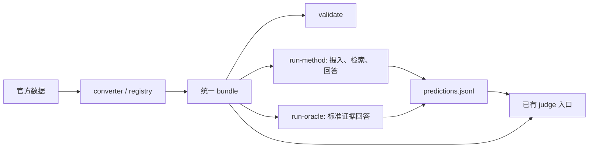

# 新增六个 benchmark 的数据接入

本文统一说明 MobileMem 文本版、MobileMem-Omni、SMMBench、Persona-MME、PersonaMem-v2 和 M³Exam 公开示例的数据接入：下载官方快照、转换统一 bundle、验证引用和资产，并通过仓库已有入口运行评测。这些接入不属于原论文固定四个 benchmark 的结果，也不表示已经复现各数据集的原生评分协议。

## 与原仓库的关系

```text
官方数据快照
  └─ hf download（MobileMem text）或 scripts/download_additional_benchmarks.py
       └─ data/raw/<benchmark>/
            └─ mmmb convert <benchmark> --raw-root data/raw --output-root data/unified
                 └─ benchmarks/registry.py → converters/<benchmark>.py
                      └─ BundleWriter → validate_bundle(check_assets=True)
                           └─ data/unified/<benchmark>/
                                ├─ manifest.json
                                ├─ contexts.jsonl
                                ├─ memories.jsonl
                                ├─ assets.jsonl
                                └─ questions.jsonl
```

转换后的目录继续由原有 `BundleReader`、method adapter、Reader 和 Judge 读取。无需为每个 method 再写一份新 benchmark 格式解析器。但 PDF 输入、工具规划题、特殊原生评分等仍需分别验证下游能力；有 bundle 不等于所有方法已经跑通。

方法和 Oracle 的输入优先使用原始 `speaker`；缺失、为空或为 `null` 时，回退到 `role`。原始 bundle 和 `role` 字段保持不变。只有 `role` 的记录因此会获得可见的发言者标签，已有方法 checkpoint 需要重新构建才能使用这个输入变化。

PDF 默认不预处理。使用 `--pdf-policy native_only` 提取原生文字，或使用 `native_then_ocr` / `ocr_pages` 启用 OCR；`--pdf-page-images N` 额外提供前 N 页的图片。同一 reader 内相同内容的 PDF 复用处理中或已完成的结果，解析串行执行，回答模型仍可并发调用。文字缓存只在本次运行中有效，页图写入 bundle 的 `.pdf_cache`。续跑时保持同一 PDF 策略和页图数量；更换策略需使用新的 checkpoint 和预测输出路径。

## 本次文件

| 文件 | 做什么；输入 → 输出 |
|---|---|
| [下载脚本](../scripts/download_additional_benchmarks.py) | 官方 HF/GitHub 快照 → 原始数据、媒体、版本与 SHA256 清单；不运行下载的代码。默认官方入口，可配置内容镜像。 |
| [mobilemem.py](../src/mm_memory_bench/benchmarks/converters/mobilemem.py) | MobileMem 原生文本 JSON → context、消息、最终题目及证据引用。 |
| [registry.py](../src/mm_memory_bench/benchmarks/registry.py) | 在已有注册表增加六个名称；名称 → 对应 converter。 |
| [mobilemem_omni.py](../src/mm_memory_bench/benchmarks/converters/mobilemem_omni.py) | Omni 对话、图片和全量/过滤版问题 → 同一个 bundle 的互斥题目子集。 |
| [smmbench.py](../src/mm_memory_bench/benchmarks/converters/smmbench.py) | cluster 内多来源消息、证据位置、选择题及调用计划 → bundle。 |
| [persona_mme.py](../src/mm_memory_bench/benchmarks/converters/persona_mme.py) | 人物多 session 对话和 `` 图片、主问题和 alignment 正负样本 → bundle。 |
| [personamem_v2.py](../src/mm_memory_bench/benchmarks/converters/personamem_v2.py) | benchmark CSV 引用的文本/多模态、32k/128k 历史 → 四种子集。 |
| [m3exam.py](../src/mm_memory_bench/benchmarks/converters/m3exam.py) | 官方 `example_set` 的对话、图片、PDF、题目 → **示例** bundle。 |
| [_shared.py](../src/mm_memory_bench/benchmarks/converters/_shared.py) | 共用的文本/选择题封装、资产登记、base64 图片落盘；复用原 `BundleWriter`。 |
| [转换测试](../tests/test_additional_benchmark_converters.py) | 六个 benchmark 的原生格式 fixture → 检查转换、输入隔离、运行接口、证据对应、版本隔离、答案私有字段、资产缺失处理；无模型调用。 |

## 一条 memory、一条 question 分别是什么

| Benchmark | 一条 memory | 一条 question / 原生能力字段 | 证据处理与协议边界 |
|---|---|---|---|
| MobileMem text | 每个原生 session 的一条消息，包括应用产生的 system 事件；保留来源、角色和时间，作为记忆数据，不作为模型指令。 | 仅选最终 `question_type_toolbook.question_types[*].qa_pairs`；原生 `question_type` 保留为 `task.subcategory`。 | 原生消息引用映射到 `evidence.memory_id`，重复引用去重；旧 QA、生成日志和最终画像不进入模型输入。 |
| MobileMem-Omni | 一个 session 中的一条原始 dialogue 消息；`image_inline` 成为图片资产。 | 一条原生 QA；`question_type` 保留为子类。全量题按是否属于过滤版分为 `filtered` / `unfiltered_only`。 | 原生证据主要定位 session，展开为该 session 全部消息，**不是精确消息级 gold**。解释、问题的 `image_refs`、生成画像不会混入历史。 |
| SMMBench | 一个 cluster 内某个来源流的一条消息；保留说话人、时间与 `source_id`。嵌套 JSON 中的图片也登记资产，保留 `Fig.` 引用标签；描述性原生 caption 留在私有元数据中。 | 一条 cluster 内 QA；保留原生 category/domain。普通题为 MCQ，Function_Call 为结构化调用计划。 | 按 `conversation_name + insert_conversation_turn` 的零基位置定位。干扰证据放 `misleading_evidence`，不算 gold。来源流不擅自切成 session。 |
| Persona-MME | 原生 session 中的 user 或 assistant 一次发言；按 `` 顺序绑定图片。 | 主选择题，以及原生 alignment 的 chosen/rejected 各一道二选一题；分别分组报告。 | 没有消息级标准证据。本接入为 **history-only**，不额外给原生显式 profile；与使用 profile 先验的官方设置需区分。 |
| PersonaMem-v2 | 原生历史的一条 role/content 消息，包括原生已有的 system 人物介绍；多模态 base64 图片落为资产。 | benchmark split 的一题在某种历史长度下的版本；mode、length、pref_type 等保留。 | CSV 的画像/偏好/答案不作为额外记忆。相关片段只在唯一、连续、逐条完全匹配时回链；否则不臆造证据 ID；回链结果是本地推导的片段定位，不代表官方定义了检索 Recall 指标。没有原生 session 划分。 |
| M³Exam | 一次 round 的 user 或 assistant 发言，user 侧保留图片/PDF。 | 一条示例问题；保留原生 type、label 和答案列表。 | supporting round 展开至该轮两方发言；PDF 保留原文件，读取内容需要显式启用 PDF 策略。当前仅公开示例，不能称完整测试集。 |

MobileMem-Omni 图片包的根目录是 `uid*/`，下载器将其解压到 `omni/image/`，按 GBK 解码非 UTF-8 文件名；转换器仅把目录中的空格规范为下划线，保留人物文件名中的空格。没有重新生成图片。

所有题目的答案与证据仍位于评估侧字段。`memories.jsonl` 是待摄入的数据，不是提前由某种方法提炼好的内部记忆。资产使用相对路径指向原始数据目录，**搬运 bundle 时必须同时保留对应 raw 资产或重新打包路径**。

PersonaMem-v2 在同一 mode 的 32k/128k 版本共享 semantic_question_id；它们是历史长度实验条件，汇总时不要当成两道独立语义题。选择题采用固定 SHA256 种子打乱选项，避免依赖官方脚本中跨 Python 进程不稳定的 `hash()`；选项顺序可能不同，标准答案随之同步映射。

## MobileMem 文本版的转换约定

- `person.id` 对应一个 context，不额外提供用户画像；消息保留原生 ID，并按时间建立顺序。
- 重复身份、引用其他用户轨迹的证据会导致转换失败。所有 session 在回答前可用；本接入不把 `effective_timestamp` 当成历史截断点。
- 原生单选、多选题的选项已写在问题文本中，因此保留原问题及文本回答形式，不猜测拆分选项。原生题型另存于 `metadata.native_question_form`。
- `answer.text` 保存首个原生参考答案，`answer.accepted_answers` 保存原始参考列表；这是数据保留约定，不在此规定列表的评分语义。答案与证据不交给普通方法的 Reader。
- 无证据题仍保留；已有证据 Oracle 会报告证据不可用。原生能力标签直接保留，跨 benchmark 的能力分类属于另外的工作。

固定快照生成 2 个 context、203 个 session、1,600 条 memory、1,319 道题，无媒体资产。1,981 次原始证据引用均能定位，原生 12 类题型和 3 种问题形式的统计保存在 manifest 的 `release_counts` 中。

## 下载与转换命令

在已经安装仓库环境和 `huggingface_hub` 的机器上执行；不需要 GPU 或模型密钥。默认下载官方源，网络不通时通过系统代理或 `--hf-download-endpoint` 指定镜像。大于 64 MiB 的文件分块下载并支持断点续传，最终核对官方 Git/LFS 哈希；`--workers` 控制下载并发。示例路径适用于仓库根目录。

### MobileMem 文本版

```bash
hf download zjunlp/MobileMem --repo-type dataset \
  --revision e9f9fcc97af72ea1c0b129560ec08d4c03d8c810 \
  --include 'text/mobilemem_data.json' --local-dir data/raw/mobilemem

mmmb convert mobilemem --raw-root data/raw --output-root data/unified
mmmb validate data/unified/mobilemem --check-assets
```

该源文件的 SHA-256 为 `73977e068030cee506c32b4cd01cdec788938777450a57312b5f27ce136745b1`。转换器将实际源文件哈希写入 manifest；其他快照也可转换，但比较结果时必须固定版本。

### 其余五个数据入口

```bash
python scripts/download_additional_benchmarks.py \
  mobilemem_omni smmbench persona_mme personamem_v2 m3exam \
  --raw-root data/raw --workers 12

for bench in mobilemem_omni smmbench persona_mme personamem_v2 m3exam; do
  mmmb convert "$bench" --raw-root data/raw --output-root data/unified
  mmmb validate "data/unified/$bench" --check-assets
done
```

已有输出需要重新生成时，确认路径后为 `convert` 加 `--overwrite`。下载仅涵盖 PersonaMem-v2 benchmark split 引用的历史，不下载训练集/验证集；M³Exam 仅涵盖当前公开 `example_set`。

## 使用已有评测入口

数据接入后的调用关系不变：



使用环境中已配置的 `READER_URL`、`READER_MODEL`、`JUDGE_URL`、`JUDGE_MODEL` 和相应密钥。以下以 MobileMem 文本版演示仓库已有的 Oracle 和评分命令：

```bash
mmmb run-oracle data/unified/mobilemem \
  --output runs/mobilemem/oracle/predictions.jsonl \
  --base-url "$READER_URL" --model "$READER_MODEL" \
  --memory-view raw --concurrency 2

mmmb judge data/unified/mobilemem runs/mobilemem/oracle/predictions.jsonl \
  --output runs/mobilemem/oracle/judgments.jsonl \
  --base-url "$JUDGE_URL" --model "$JUDGE_MODEL" \
  --api-key-env JUDGE_API_KEY --concurrency 1
```

Reader 使用其现有密钥环境变量（通常是 `OPENAI_API_KEY`），上例评分使用 `JUDGE_API_KEY`。小样本可给两条命令传同一个 `--question-ids` 文件。每次试验使用独立输出目录；Oracle 会重写预测文件，Judge 可续跑兼容记录。无标准证据的数据集不能直接套用证据 Oracle。

普通方法仍使用 `mmmb run-method <method> <bundle>`，按各方法的原配置准备 embedding、压缩等模型；这里不提供替换模型的轻量配置。问题白名单只限制回答题目，不会自动缩短摄入历史。长任务可使用已有的 `--resume-predictions`、`--continue-on-query-error`，并单独报告失败题目。

评分输出沿用 `judgments.jsonl` 和 `judgments.summary.json`。Oracle 衡量标准证据条件下的回答能力；普通方法包含摄入与检索。两者结果必须分开标注，通用评分不等于原生评分协议复现。

## 验证范围与限制

- 六个入口已做数据转换、ID/证据引用及资产完整性检查；对应测试文件见上表。
- MobileMem 文本版已做 Oracle 和方法小样本；其余五个数据入口也已完成五种方法的小样本执行。诊断使用缩短历史，部分切片按标准证据选取，不能作为正式成绩。
- 当时的 LightMem 成功运行依赖单独的来源关联修复；仅提交数据转换代码不保证复现该方法的成功结果。运行记录属于当时工作区的验证，不能直接当作隔离后数据适配 MR 的验收。
- SMMBench 的 LightMem/VimRAG 候选工具传递尚有缺口；工具规划的通用评分不替代原生 FC 指标。
- M³Exam 仅公开示例；PDF 策略提供文字和可选页图，扫描页需要 OCR 或页图。文件校验通过不等于模型已读取全部 PDF 内容。
- Persona-MME 使用 history-only；PersonaMem-v2 四种条件需分别报告。Omni 当前公开题单与论文题单的对应关系尚未确认。

## 官方来源

- [MobileMem 数据](https://huggingface.co/datasets/zjunlp/MobileMem)、[Omni 转换参考](https://github.com/zjunlp/MobileMem/blob/main/omni/eval/eval/Raw2Locomo.py)。
- [SMMBench 数据](https://huggingface.co/datasets/HuacanChai/SMMBench)、[官方评测实现](https://github.com/FatCatCHC/SMMBench)。
- [Persona-MME 数据](https://huggingface.co/datasets/ClareNie/Persona-MME)、[PersonaVLM](https://github.com/MiG-NJU/PersonaVLM)。
- [PersonaMem-v2 数据](https://huggingface.co/datasets/bowen-upenn/PersonaMem-v2)、[官方推理脚本](https://github.com/bowen-upenn/PersonaMem-v2/blob/main/inference.py)。
- [M³Exam 官方仓库与公开示例](https://github.com/EverM0re/M-3-Exam)。

实际下载版本和本机完整性以各 `data/raw/<name>/download-manifest.json`、`download-files.json` 为准。

## PersonaMem-v2 多模态开放回答

现有 converter 同时生成原有四种 MCQ 条件和新增的两种多模态 `generative` 条件。文本开放题不在本轮范围。与官方 `inference.py` 的 `generative` 路径一致：复用同一 CSV 行的 `user_query` 和对应历史，追加原有偏好回忆指令，不添加 MCQ 选项消息。原始问题、历史和偏好不进行改写。

| 记录 | 本次处理 |
|---|---|
| 原有 MCQ | 保留原 ID、subset、选项和答案；回答指令对齐官方 `Final Answer: [Letter]` 格式 |
| 新开放题 | ID 为配对 MCQ ID 加 `:generative`；subset 为 `multimodal_32k_generative` 或 `multimodal_128k_generative` |
| 历史、图片、证据 | 与配对 MCQ 共用 context、memory、asset 和 evidence，不复制记忆；片段证据仍是本地匹配推导，非官方标准检索证据 |
| 提问与回答格式 | prompt 与配对 MCQ 相同，去除 choices，instruction 为空，response_type 为 text |
| 标准字段 | answer.text 原样保存 CSV correct_answer；metadata.preference 和 prev_pref 保存原始字段，native_judge_kind 按官方 `preference.lower().startswith("do not")` 选择正/负向 |
| 信息隔离 | 偏好等新字段属于评估侧 metadata，现有 `_resolved_question()` 不传给 method；原历史已包含的信息照常保留 |

固定官方数据快照含 20,000 条原有 MCQ，新增 10,000 条多模态开放题；合计 30,000 条**实验记录**，不是 30,000 道独立语义问题。记忆与图片数量不变。官方数据 revision 为 `ed956dea41521fc4499acbc63f966e0fd3c053ba`；此次对照的官方代码 revision 为 `d29d91d016add354e459dfeb0d24af08bc402e2a`。

转换沿用上文 `mmmb convert personamem_v2`。运行时必须按轨道选题，例如为多模态 32k 开放题生成白名单：

```bash
python - <<'PYIDS'
import json
from pathlib import Path
bundle = Path("data/unified/personamem_v2")
ids = []
for line in (bundle / "questions.jsonl").open():
    q = json.loads(line)
    if q.get("subset") == "multimodal_32k_generative":
        ids.append(q["question_id"])
Path("generative_32k_ids.txt").write_text("\n".join(ids) + "\n")
PYIDS
```

将该文件传给原有 `run-method ... --question-ids generative_32k_ids.txt`，使用各方法原有模型配置。MCQ 和开放题使用不同预测文件；记忆索引能否共用仍遵循各 method 的 checkpoint 约束，不自动复用旧预测。

**开放题使用独立的原生偏好评分协议**，复用现有 `judge` 命令。默认 `qa` 协议仍然是原有二元正确性 Judge；显式选择 `personamem_v2_open` 时，使用官方 narrow 正/负向 prompt，输入只有原始问题、目标偏好和模型回答，输出 0～1 分。不能用 MCQ 脚本替代。

```bash
mmmb judge data/unified/personamem_v2 generative_predictions.jsonl \
  --output generative_judgments.jsonl \
  --model "$JUDGE_MODEL" --base-url "$JUDGE_URL" \
  --api-key-env JUDGE_API_KEY \
  --scoring-protocol personamem_v2_open \
  --question-ids generative_32k_ids.txt --concurrency 4
```

需要重新转换 bundle，以包含开放题 `metadata.native_user_query`：它原样保存追加回忆指令之前的题目。缺字段时明确报错，不从 Reader prompt 猜测恢复。旧 MCQ 的只返回标签指令也需要通过重新转换更新，并使用新预测文件重新作答。原始问题、偏好等评估侧 metadata 不传给 method。

`judgments.jsonl` 保存 `score`、`judge_response`、`preference_kind`、协议及输入哈希，不产生 `correct`。汇总报告 `mean_score_valid_only`、`mean_score_conservative`，以及按历史长度和偏好正负向分组的均分，不称为 Accuracy，也不把两个长度当作独立语义题混报。

沿用官方一次 narrow Judge 调用；保留官方数值解析顺序和 boxed 分数裁剪规则。无法解析时按官方返回 0，仍属于已完成评分；API 调用异常才记录为可续跑的评分错误。协议已更新为 `mmmb-personamem-v2-narrow-1.1`，避免复用旧解析规则的缓存。生成失败或空回答计 0，不调用 Judge。修改评分输入、预测、模型或协议后不复用旧记录；首次运行旧的无输入哈希评分文件会重新评分。

MCQ 与开放题需分别选题、保存输出；`score_script.py` 仅用于支持的脚本题。通用二元 Judge 仍可显式用于额外的答案正确性分析，但不代表原生偏好得分。

官方来源：[生成路径](https://github.com/bowen-upenn/PersonaMem-v2/blob/d29d91d016add354e459dfeb0d24af08bc402e2a/inference.py)、[偏好评分输入](https://github.com/bowen-upenn/PersonaMem-v2/blob/d29d91d016add354e459dfeb0d24af08bc402e2a/inference_utils.py)、[数据快照](https://huggingface.co/datasets/bowen-upenn/PersonaMem-v2/tree/ed956dea41521fc4499acbc63f966e0fd3c053ba)。

## 转换测试

```bash
python -m unittest discover -s tests -p 'test_additional_benchmark_converters.py'
```

该文件统一覆盖六个数据入口及下载完整性，不调用模型或依赖 Judge 新增功能。
